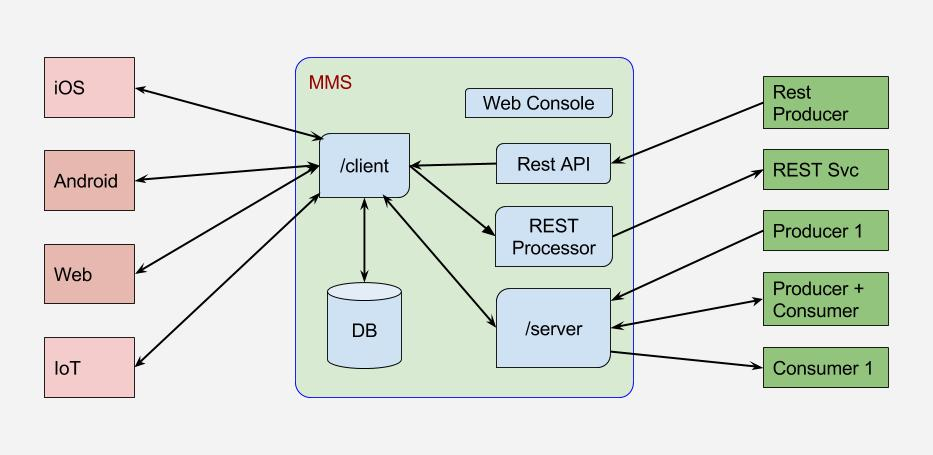

# MMS Architecture

The client apps run on real-world networks and user owned hardware. The QoS on real-world networks are unpredictable, based several factors such as location, ISP, Wireless provider, peak times, load on the network etc. On the other hand, server applications are hosted within a datacenter, where hardware, capacity, network are under control of the application owner. 



MMS bridges client apps with the server apps.

Client Apps can be,

* Android
* iOS
* Web
* IoT ( Internet of Things )

Server Apps can be,

* Rest Services
* Messaging Systems

## Client Apps

Client Apps connect to ```/client``` end point.

## Server Apps

Server Apps connect to ```/server``` end point.